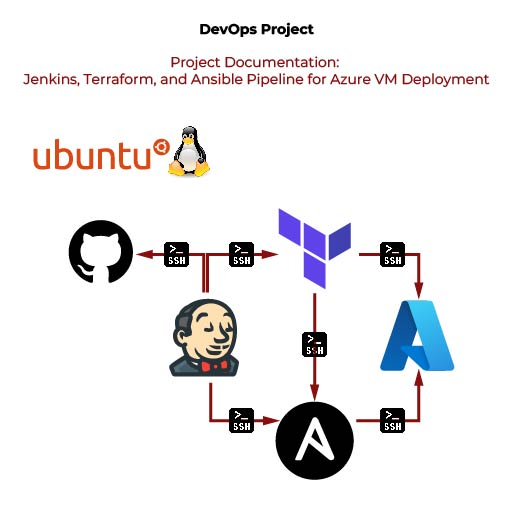

# DevOps Environment Setup with Terraform, Ansible, and Jenkins on Azure

## Project Overview
This project demonstrates an end-to-end setup of a DevOps environment utilizing **Terraform** for infrastructure provisioning, **Ansible** for configuration management, and **Jenkins** for CI/CD pipeline automation, all deployed on **Azure**. The project is architected across three distinct Ubuntu VMs, each dedicated to hosting one of these DevOps tools, achieving a modular and scalable infrastructure that facilitates a streamlined deployment process for cloud environments.

---

## Architecture Diagram


The architecture diagram above illustrates the setup:
- **Terraform Server**: Handles Infrastructure as Code (IaC) provisioning.
- **Ansible Server**: Manages configuration and application deployment.
- **Jenkins Server**: Automates CI/CD tasks to enable streamlined deployment processes.

---

## Objectives
The primary objectives of this project are to:
1. **Automate Infrastructure Provisioning**: Terraform manages infrastructure resources on Azure through a code-based approach.
2. **Streamline Configuration Management**: Ansible ensures consistent configuration across cloud resources, allowing quick setups and scalable configurations.
3. **Enable Continuous Deployment**: Jenkins connects all components, automating deployment pipelines, and enabling a continuous deployment workflow.

---

## Project Structure

### 1. **Terraform**
Terraform is a widely used Infrastructure as Code (IaC) tool that simplifies provisioning and managing cloud resources. In this project, Terraform provisions and configures several core resources on Azure, such as Virtual Machines (VMs), Virtual Networks, and Security Groups.

#### Key Components
- **azurevm.tf**: Main configuration file defining Azure infrastructure, specifying network configurations, security rules, and virtual machines.
- **terraform.tfvars**: Contains environment-specific variables, including sensitive credentials (e.g., `client_id`, `client_secret`, `subscription_id`). It’s advisable to keep this file outside version control.
- **variables.tf**: Defines reusable variables used in the Terraform configurations for flexibility and dynamic adjustments.

#### Key Terraform Commands
1. **Initialize**: `terraform init` — sets up the workspace and downloads provider plugins (e.g., Azure).
2. **Plan**: `terraform plan` — shows an execution plan, detailing which resources will be created, modified, or destroyed.
3. **Apply**: `terraform apply` — deploys resources as specified in the configuration files.

By defining infrastructure in code, Terraform reduces manual setup tasks and helps ensure a repeatable and error-free deployment process.

### 2. **Ansible**
Ansible is a configuration management tool that allows automating application deployment, software updates, and resource configurations on Azure VMs. Using Ansible, configuration tasks are defined in playbooks and inventory files for a highly repeatable configuration process.

#### Key Ansible Components
- **inventory.ini**: Contains the list of Azure VMs, specifying SSH connection details for secure access.
- **playbook.yml**: Defines tasks for configuring the VMs, such as installing web servers like Nginx, setting up user permissions, and more.

#### How Ansible Works in This Project
1. **Server Configuration**: After Terraform provisions the Azure VMs, Ansible is used to install and configure required software and services on these VMs, reducing the need for manual setup.
2. **Playbooks and Inventory Management**: The playbooks in Ansible define tasks in a structured format, while the inventory file specifies hosts that Ansible will configure, simplifying VM configuration across environments.

Ansible ensures consistency across VMs, allowing easy configuration replication on additional resources or new instances.

### 3. **Jenkins**
Jenkins serves as the CI/CD automation tool, orchestrating the entire process from provisioning to configuration. By integrating with GitHub, Jenkins fetches code changes, triggering pipelines to automate infrastructure deployment and configuration tasks.

#### Pipeline Configuration
The Jenkins pipeline consists of multiple stages:
1. **Source Code Management**: Configures GitHub as the source for code and configurations.
2. **Terraform Execution**: Initializes and applies Terraform scripts to provision infrastructure on Azure.
3. **Ansible Execution**: After infrastructure is provisioned, Ansible playbooks are triggered to configure Azure VMs, completing the setup.

---

## Setup Guide

### Pre-requirements
1. **VirtualBox and Virtual Machines**: Create three Ubuntu VMs using VirtualBox, each serving as a dedicated server for:
   - **Jenkins**: CI/CD server.
   - **Ansible**: Configuration management.
   - **Terraform**: Infrastructure provisioning.
   
2. **MobaXterm**: Use MobaXterm to manage SSH connections and access to the Ubuntu VMs.

### Terraform and Ansible File Details

#### Terraform Files
- **azurevm.tf**: Specifies Azure resources, defining VMs, networking, and security configurations.
- **terraform.tfvars**: Stores environment-specific values (e.g., credentials). Avoid adding this to version control to prevent credential exposure.
- **variables.tf**: Defines flexible parameters for reusability.

#### Ansible Files
- **inventory.ini**: Lists hosts (Azure VMs), their IPs, and SSH details for remote configuration.
- **playbook.yml**: Automates the installation and setup of services (e.g., Nginx), enabling a consistent and efficient setup process across VMs.

---

## Usage Guide

### 1. Terraform Commands
```shell
terraform init       # Initialize the working directory
terraform plan       # Preview infrastructure changes
terraform apply      # Apply the configuration to Azure
```

### 2. Ansible Commands
```shell
ansible-playbook -i inventory.ini playbook.yml  # Run Ansible playbook to configure Azure VMs
```


### 3. Jenkins Pipeline Setup
- **Source Control**: Link Jenkins to your GitHub repository to fetch configuration files.
- **Pipeline Stages**:
  - **Stage 1**: Runs Terraform commands to provision the infrastructure.
  - **Stage 2**: Executes Ansible playbook to configure Azure resources.

---

## Troubleshooting and Common Issues

- **SSH Connectivity**: Ensure the Network Security Group (NSG) allows SSH connections on port 22. Terraform and Ansible may encounter connectivity issues if port configurations are restricted.
- **Azure Free Trial Limitations**: Azure trial subscriptions may limit certain VM capabilities, affecting the ability to run all configurations. Consider upgrading to a paid subscription for complete functionality.
- **SSH Key Management**: Manage SSH keys carefully for each VM. Use the private key specified in `inventory.ini` for secure access.

---

## Conclusion

By combining Terraform, Ansible, and Jenkins, this project provides a comprehensive solution for provisioning, configuring, and automating infrastructure deployments on Azure. This setup not only simplifies the infrastructure management process but also allows for scalability, reliability, and efficient workflow automation in cloud environments.


## Contributors
- [Rey Sylaj](https://github.com/reysylaj)
- [Arnold Hoxha](https://github.com/arnoldhoxha)
